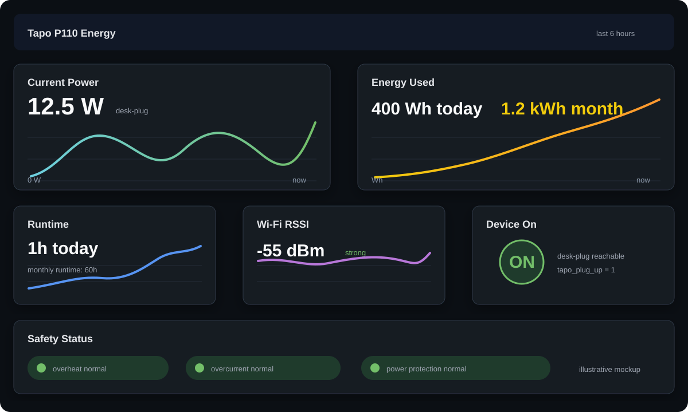

# Tapo Probe

Local-first probe and Prometheus exporter for TP-Link Tapo P110 smart plug energy readings.

The tool can run once to append JSONL readings, or run continuously as a local exporter for Grafana Alloy and Grafana Cloud.

## Setup

```bash
python3 -m venv .venv
source .venv/bin/activate
python -m pip install -e '.[dev]'
```

Create `.env` for your Tapo cloud account credentials. The local Tapo protocol library uses these credentials to authenticate to plugs on your LAN. `.env` is ignored by git.

```dotenv
TAPO_USERNAME=you@example.com
TAPO_PASSWORD=your-password
```

Shell environment variables with the same names override `.env` values.

In the Tapo app, enable local third-party access: `Me > Third-Party Services > Third-Party Compatibility`. Without this, plugs can be discovered but local energy reads can fail with `FORBIDDEN`.

## Device Config

Create a local config file. `tapo-config.json` is ignored by git.

```json
{
  "devices": [
    {"name": "desk", "hostname": "desk-plug", "ip": "192.168.1.50"}
  ]
}
```

Fields:

- `name`: stable local name for CLI output and metric labels.
- `ip`: plug LAN IP address.
- `hostname`: optional dashboard-friendly label. If omitted, the exporter uses the Tapo nickname when available, then `name`.

If you do not know plug IP addresses, check router DHCP leases, a LAN scanner, or the Tapo app device details. Configure static DHCP reservations once found so dashboard labels remain stable.

You can also scan for devices:

```bash
tapo-probe --discover
```

## One-Shot Probe

Run a probe and append readings to JSONL:

```bash
tapo-probe --config tapo-config.json --output tapo-readings.jsonl
```

Each JSONL line contains timestamp, configured device name, IP, normalized power fields, and raw fields useful for troubleshooting firmware differences.

## Prometheus Exporter

Run the exporter locally:

```bash
tapo-probe serve --config tapo-config.json --port 9108 --interval 60
```

Metrics are exposed at `http://localhost:9108/metrics`. Each metric includes `hostname`, `ip`, `name`, `nickname`, and `alias` labels.

Primary metrics:

- `tapo_plug_power_watts`
- `tapo_plug_today_energy_wh`
- `tapo_plug_month_energy_wh`
- `tapo_plug_today_runtime_seconds`
- `tapo_plug_month_runtime_seconds`
- `tapo_plug_rssi_dbm`
- `tapo_plug_up`
- `tapo_plug_on_time_seconds`
- `tapo_plug_signal_level`
- `tapo_plug_overheat`
- `tapo_plug_overcurrent`
- `tapo_plug_power_protection_triggered`
- `tapo_plug_info`

Dashboard-compatible metrics are also emitted:

- `tapo_energyUsage_currentPower` in milliwatts
- `tapo_energyUsage_todayEnergy`
- `tapo_energyUsage_monthEnergy`
- `tapo_energyUsage_todayRuntime`
- `tapo_energyUsage_monthRuntime`
- `tapo_deviceInfo_rssi`
- `tapo_deviceInfo_device_on`

## User Service Installer

Run the installer from the repo root:

```bash
scripts/install-service.sh
```

The installer is user-level by default. It does not require sudo. On macOS and Linux, the installer manages both the exporter and Grafana Alloy so local collection and Grafana Cloud remote_write survive login/reboot.

What it does:

- Creates `.venv` if needed and installs this package.
- Creates `~/.config/tapo-probe/tapo-config.json` with a sample device if it does not exist.
- On macOS, installs `~/Library/LaunchAgents/com.tapo-probe.exporter.plist`.
- On macOS, installs `~/Library/LaunchAgents/com.tapo-probe.alloy.plist` when `alloy` is available.
- On Linux, installs `~/.config/systemd/user/tapo-probe.service`.
- On Linux, installs `~/.config/systemd/user/tapo-probe-alloy.service` when `alloy` is available.
- Starts the exporter with `tapo-probe serve --config ~/.config/tapo-probe/tapo-config.json --port 9108 --interval 60`.
- Starts Alloy with a managed `~/.config/tapo-probe/alloy.config` copied from `grafana/alloy.config.example`.

The service starts automatically after user login. On Linux user services, reboot autostart also depends on the user's systemd user manager; it starts after login by default. For headless boot before login, enable lingering manually with `loginctl enable-linger "$USER"`.

Before relying on the service, edit:

```bash
~/.config/tapo-probe/tapo-config.json
```

Keep Tapo and Grafana credentials in `.env` in this repo or set them in the service environment using your OS service tooling. The managed Alloy wrapper sources `.env` without printing values. Do not put credentials in `tapo-config.json`.

Install Alloy before running the installer if you want Grafana Cloud remote_write managed automatically:

```bash
brew install grafana/grafana/alloy
```

For Linux package installation options, see the Grafana Alloy Linux install docs: https://grafana.com/docs/alloy/latest/set-up/install/linux/

Installer commands:

```bash
scripts/install-service.sh install
scripts/install-service.sh status
scripts/install-service.sh uninstall
```

macOS service commands:

```bash
launchctl print gui/$(id -u)/com.tapo-probe.exporter
launchctl print gui/$(id -u)/com.tapo-probe.alloy
launchctl kickstart -k gui/$(id -u)/com.tapo-probe.exporter
launchctl kickstart -k gui/$(id -u)/com.tapo-probe.alloy
launchctl bootout gui/$(id -u) ~/Library/LaunchAgents/com.tapo-probe.exporter.plist
launchctl bootout gui/$(id -u) ~/Library/LaunchAgents/com.tapo-probe.alloy.plist
```

macOS logs:

```bash
tail -f ~/Library/Logs/tapo-probe.out.log ~/Library/Logs/tapo-probe.err.log ~/Library/Logs/tapo-probe-alloy.err.log
```

Linux service commands:

```bash
systemctl --user status tapo-probe.service
systemctl --user status tapo-probe-alloy.service
systemctl --user restart tapo-probe.service
systemctl --user restart tapo-probe-alloy.service
systemctl --user stop tapo-probe.service
systemctl --user stop tapo-probe-alloy.service
```

Linux logs:

```bash
journalctl --user -u tapo-probe.service -f
journalctl --user -u tapo-probe-alloy.service -f
```

Set a different listen port or poll interval during install:

```bash
TAPO_PROBE_PORT=9110 TAPO_PROBE_INTERVAL=30 scripts/install-service.sh
```

## Container

Build an exporter-only image with Docker:

```bash
docker build -f Containerfile -t tapo-probe:local .
```

Or with Podman:

```bash
podman build -f Containerfile -t tapo-probe:local .
```

Run the exporter with a mounted config file and credentials from the environment:

```bash
docker run --rm \
  -p 9108:9108 \
  -e TAPO_USERNAME='you@example.com' \
  -e TAPO_PASSWORD='your-password' \
  -v "$PWD/tapo-config.json:/config/tapo-config.json:ro" \
  tapo-probe:local
```

Podman uses the same arguments:

```bash
podman run --rm \
  -p 9108:9108 \
  -e TAPO_USERNAME='you@example.com' \
  -e TAPO_PASSWORD='your-password' \
  -v "$PWD/tapo-config.json:/config/tapo-config.json:ro" \
  tapo-probe:local
```

The container runs `tapo-probe serve --config /config/tapo-config.json --port 9108 --interval 60` by default. Keep `.env` and local config files outside the image; `.dockerignore` excludes common secret and local runtime files from the build context.

## Grafana Cloud

Install Grafana Alloy and copy `grafana/alloy.config.example` to your Alloy config path. Set these environment variables from your Grafana Cloud Prometheus remote_write details:

```bash
export GRAFANA_CLOUD_PROM_URL='https://prometheus-prod-xx.grafana.net/api/prom/push'
export GRAFANA_CLOUD_PROM_USER='your-prometheus-user-id'
export GRAFANA_METRICS_WRITE='your-grafana-cloud-metrics-write-token'
export GRAFANA_METRICS_READ='your-grafana-cloud-metrics-read-token'
```

`GRAFANA_CLOUD_PROM_URL` must be the Prometheus remote_write endpoint from Grafana Cloud, not a dashboard URL. Dashboard URLs like https://example.grafana.net/d/ are for viewing dashboards and cannot receive metrics.

`GRAFANA_METRICS_WRITE` must be valid for Grafana Cloud Metrics remote_write. A Grafana service account token that can call the Grafana dashboard API may still fail remote_write with `401 Unauthorized: invalid token` unless it has the Grafana Cloud Metrics publish/write permission. `GRAFANA_METRICS_READ` is used only for verification queries.

## Sample Dashboard

Import `grafana/tapo-p110-dashboard.sample.json` into Grafana and choose your Prometheus data source. The dashboard uses the compatibility metric names emitted by the exporter, including `tapo_energyUsage_currentPower`, `tapo_energyUsage_todayEnergy`, and `tapo_deviceInfo_rssi`.

Illustrative preview of the sample dashboard:



Useful PromQL examples:

```promql
tapo_plug_power_watts
tapo_plug_power_watts{hostname="desk-plug"}
tapo_energyUsage_currentPower / 1000
tapo_plug_up == 0
tapo_plug_overheat or tapo_plug_overcurrent or tapo_plug_power_protection_triggered
```

## Development

```bash
pytest -v
bash -n scripts/install-service.sh
```
